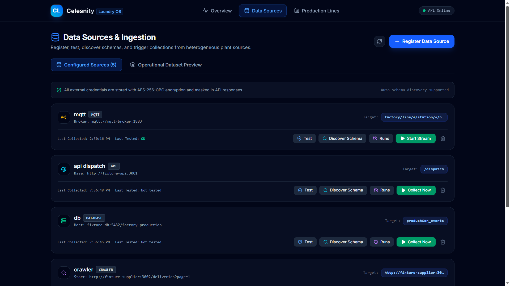
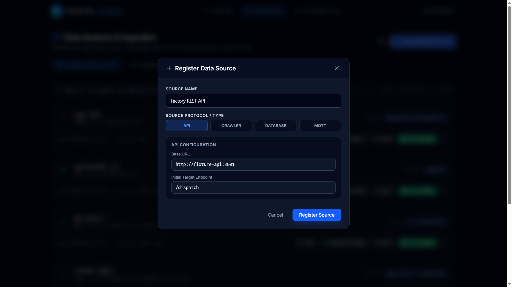
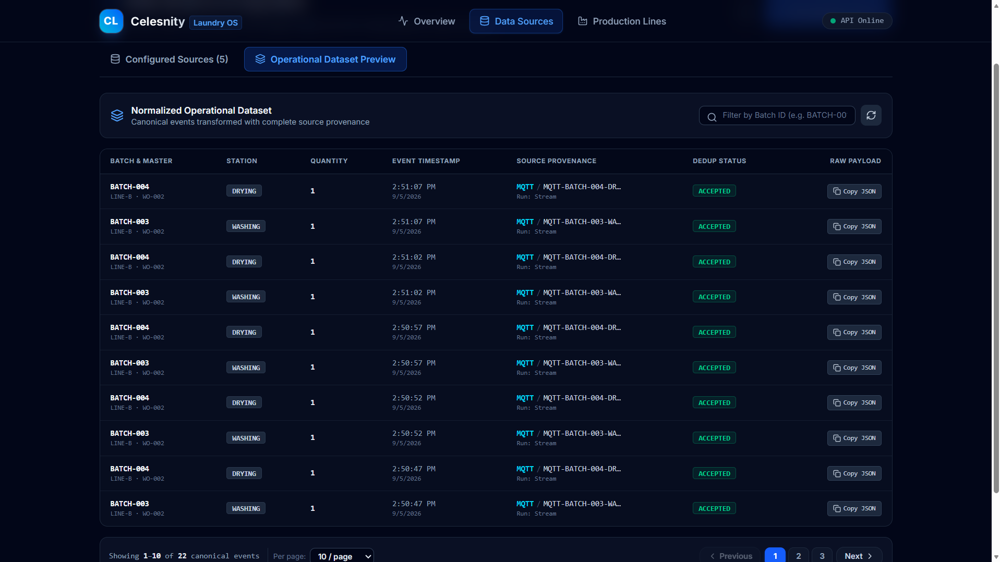
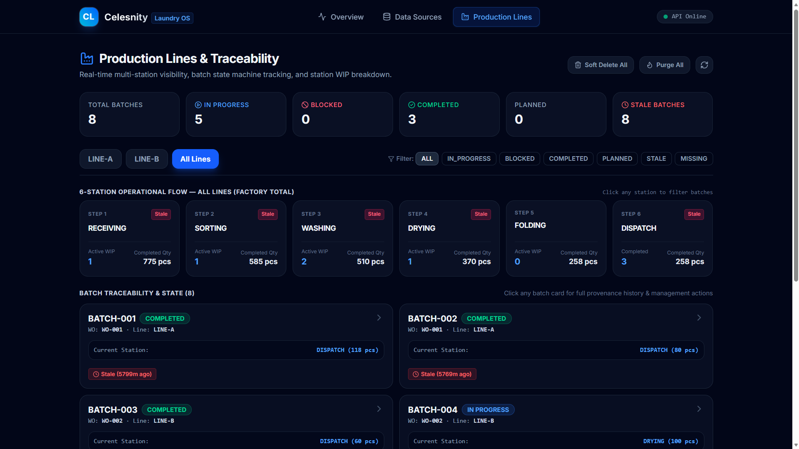
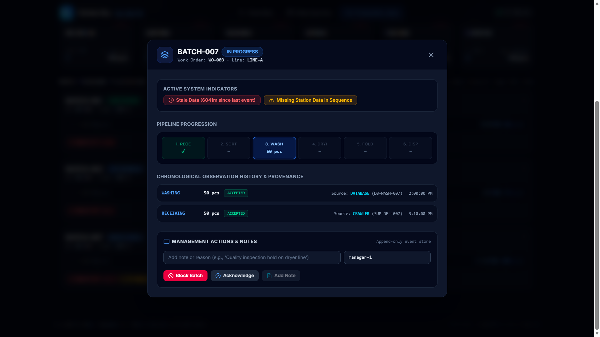
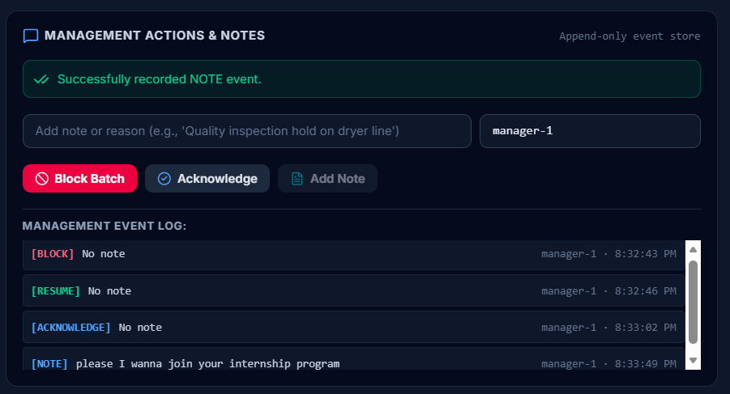

# Celesnity — Industrial Laundry Factory Operations Data Platform

An end-to-end factory data platform that ingests heterogeneous industrial data from multiple plant sources (REST APIs, Web Scrapers, PostgreSQL databases, and MQTT telemetry), normalizes and deduplicates it into a unified, traceable operational dataset, and visualizes batch flow across a 6-station industrial laundry pipeline.

---

## 🏛️ Architecture Overview

```
┌────────────────────────────────────────────────────────────────────────────────────┐
│                                Plant Data Sources                                  │
│                                                                                    │
│  ┌────────────────┐   ┌────────────────┐   ┌────────────────┐   ┌────────────────┐ │
│  │    REST API    │   │  Supplier Web  │   │ Production DB  │   │ Mosquitto MQTT │ │
│  │  (Port 3001)   │   │  (Port 3002)   │   │  (Port 5433)   │   │  (Port 1883)   │ │
│  └───────┬────────┘   └───────┬────────┘   └───────┬────────┘   └───────┬────────┘ │
└──────────┼────────────────────┼────────────────────┼────────────────────┼──────────┘
           │                    │                    │                    │
           ▼                    ▼                    ▼                    ▼
┌───────────────────────────────────────────────────────────────────────────────────┐
│                           NestJS 11 Backend (Port 3000)                           │
│                                                                                   │
│  ┌──────────────────────┐   ┌──────────────────────┐   ┌───────────────────────┐  │
│  │  Collection Engine   │   │ Normalization Engine │   │ Production Line Svc   │  │
│  │  • API Collector     │   │ • Deterministic Dedup│   │ • 6-Station Pipeline  │  │
│  │  • HTML Web Crawler  │   │ • Conflict Hierarchy │   │ • Batch State Machine │  │
│  │  • Pg DB Collector   │   │ • Provenance Capture │   │ • Staleness Alerts    │  │
│  │  • MQTT Telemetry    │   │ • Master Data Join   │   │ • Missing-Data Flags  │  │
│  └──────────┬───────────┘   └──────────┬───────────┘   └───────────┬───────────┘  │
│             │                          │                           │              │
│             └──────────────────────────┼───────────────────────────┘              │
│                                        ▼                                          │
│                          ┌───────────────────────────┐                            │
│                          │ App Database (PostgreSQL) │                            │
│                          │ • data_sources            │                            │
│                          │ • collection_runs         │                            │
│                          │ • canonical_events        │                            │
│                          │ • management_events       │                            │
│                          └─────────────┬─────────────┘                            │
└────────────────────────────────────────┼──────────────────────────────────────────┘
                                         │ REST API (/api)
                                         ▼
┌───────────────────────────────────────────────────────────────────────────────────┐
│                    Next.js 16 + React 19 Frontend (Port 3003)                     │
│                                                                                   │
│  • /sources    — Source registration, schema discovery, collection trigger,       │
│                  run error inspection, and normalized dataset preview             │
│  • /production — Multi-line dashboard, 6-station WIP board, batch cards,          │
│                  staleness / missing-data indicators, and management actions      │
│  • /           — Factory overview & KPI throughput summary                        │
└───────────────────────────────────────────────────────────────────────────────────┘
```

---

## 🚀 Quick Start

### Option A: Running with Docker Compose (Recommended)

Starts all 8 services (App DB, Fixture DB, Fixture API, Supplier Site, Mosquitto MQTT broker, MQTT Simulator, Backend, and Frontend):

```bash
# 1. Copy environment template
cp .env.example .env

# 2. Build and start all containers
docker compose up --build
```

| Service | URL / Address |
|:---|:---|
| **Frontend UI** | [http://localhost:3003](http://localhost:3003) |
| **Backend API** | [http://localhost:3000/api](http://localhost:3000/api) |
| **Fixture REST API** | [http://localhost:3001](http://localhost:3001) |
| **Fixture Supplier Web** | [http://localhost:3002](http://localhost:3002) |
| **Fixture Database** | `localhost:5433` (database: `factory_production`) |
| **App Database** | `localhost:5434` (database: `celesnity_app`) |
| **MQTT Broker** | `localhost:1883` (Mosquitto) |

> **Tip:** After changing environment variables in `.env` or `docker-compose.yml`, run `docker compose up -d --force-recreate` to apply changes without a full rebuild. A rebuild (`docker compose build`) is only needed when source code or `package.json` changes.

---

### Option B: Running Locally with Monorepo Workspaces

If you prefer running services directly on your host machine with hot reload:

```bash
# 1. Start the backing databases and MQTT broker in Docker
docker compose up -d app-db fixture-db mqtt-broker

# 2. Configure backend environment (copy example template)
cp packages/backend/.env.example packages/backend/.env

# 3. Install all dependencies across all monorepo packages
npm install

# 4. Start all services concurrently (API, Supplier, MQTT, Backend, Frontend)
npm run dev

# 5. In another terminal, run backend unit test suites
npm test
```

> **Note on Database Ports:** 
> * When accessing PostgreSQL from your **host machine** (local dev), connect to `localhost:5434` for `app-db` and `localhost:5433` for `fixture-db`.
> * When accessing PostgreSQL from **inside Docker containers**, connect to hostname `app-db:5432` and `fixture-db:5432`.
> * The backend defaults to `APP_DB_PORT=5434` in development and fallback mode to match the host docker port mapping.

---

## 🗺️ User Manual: End-to-End Workflow

Once the platform is running, follow this workflow to go from raw sources to a live production dashboard.

### Step 1 — Open the Data Sources page

Navigate to **[http://localhost:3003/sources](http://localhost:3003/sources)**.

This is the control panel for all data ingestion. It lists all registered sources with their type, last collection time, and status.



---

### Step 2 — Register a Source

Click **"Register Source"** and fill in the form:

#### Register Source #1 — Factory REST API
| Field | Value |
|:---|:---|
| **Name** | `Factory REST API` *(pre-filled)* |
| **Type** | `API` |
| **Base URL** | `http://fixture-api:3001` *(pre-filled)* |
| **Target Endpoint** | `/dispatch` *(pre-filled)* |

Click **"Register Source"**.



#### Register Source #2 — Supplier HTML Crawler
| Field | Value |
|:---|:---|
| **Name** | `Supplier Delivery Crawler` *(pre-filled)* |
| **Type** | `CRAWLER` |
| **Start URL** | `http://fixture-supplier:3002/deliveries?page=1` *(pre-filled)* |

Click **"Register Source"**.

#### Register Source #3 — Plant Production Database
| Field | Value |
|:---|:---|
| **Name** | `Plant Production DB` *(pre-filled)* |
| **Type** | `DATABASE` |
| **Host** | `fixture-db` |
| **Port** | `5432` |
| **Database** | `factory_production` |
| **Username** | `factory` |
| **Password** | `factory_secret` |
| **Target Table** | `production_events` *(pre-filled)* |

Click **"Register Source"**.

> **Docker networking note:** Use container hostnames (`fixture-api`, `fixture-db`, `fixture-supplier`) when running via Docker Compose. Use `localhost` with the mapped ports (`3001`, `5433`, `3002`) when running locally.

---

### Step 3 — Run Collection

For each registered source, click **"Collect Now"** on its source card.

- The button changes to a **"Stop"** spinner while ingestion is in progress. (MQTT only)
- Once complete, the **collection history drawer** opens, showing duration, records collected, records failed, and error details for each run.

> **Tip:** Collect the REST API source multiple times on purpose to see how the deduplication engine marks repeat records as `DUPLICATE` without double-counting.

---

### Step 4 — Preview Normalized Records

After collection, click the **"Operational Dataset Preview"** tab on the Sources page.

This table shows all canonical events ingested across all runs with pagination, including:
- `batchId`, `stationCode`, `quantity`, `eventTime`
- **Source provenance** — which source type and run produced each record
- **Status badge** — `ACCEPTED`, `DUPLICATE`, or `CONFLICT`
- **Raw Payload** — click `Copy JSON` to inspect the original payload from the source




---

### Step 5 — Inspect the Production Dashboard

Navigate to **[http://localhost:3003/production](http://localhost:3003/production)**.

The dashboard shows all active production lines (`LINE-A`, `LINE-B`) and their batch cards:
- **Current station** — the furthest station reached by each batch
- **Batch state** — `PLANNED`, `IN_PROGRESS`, `BLOCKED`, or `COMPLETED`
- **Data freshness** — minutes since the last event, with a 🔴 stale indicator after 15 min (configurable)
- **Missing-data indicator** — 🟡 if a later station exists but an earlier one is missing



Click any batch card to open the **Batch Detail Modal** and inspect its full station history, source provenance, and management action log.



---

### Step 6 — Apply a Management Action

Inside any batch's detail modal:
- **Block Batch** — places a supervisory hold; the batch state changes to `BLOCKED` ⛔
- **Resume Batch** — clears the hold; the state returns to `IN_PROGRESS`
- **Acknowledge** — logs an acknowledgment event to the audit trail
- **Add Note** — attaches a free-text operational note

All actions are append-only. No source history is ever overwritten.



---

## 🧺 6-Station Industrial Laundry Pipeline

Hotel linen batches progress through 6 strict operational stages:

| Step | Station Code | Covered In Fixture | Description |
| :---: | :--- | :--- | :--- |
| **1** | `RECEIVING` | REST API (`/receiving`) & HTML Crawler | Soiled linen received from hotel suppliers |
| **2** | `SORTING` | Production DB (`production_events`) | Sorted by fabric type and soil level |
| **3** | `WASHING` | Production DB & MQTT Telemetry | High-temp industrial wash cycles |
| **4** | `DRYING` | Production DB & MQTT Telemetry | Tumble and moisture-controlled drying |
| **5** | `FOLDING` | Production DB (`production_events`) | Automated folding and count verification |
| **6** | `DISPATCH` | REST API (`/dispatch`) & Production DB | Packed and dispatched back to customer hotels |

---

## 🧠 Business Logic & State Machine

### 1. Batch State Machine
Batch state is evaluated in strict sequential priority per specification:

1. **`COMPLETED`**: At least one accepted `DISPATCH` event exists.
2. **`BLOCKED`**: No dispatch event exists AND an active manager `BLOCK` event is present.
3. **`IN_PROGRESS`**: No block or dispatch event exists AND at least one accepted event (`RECEIVING` through `FOLDING`) is present.
4. **`PLANNED`**: Work order exists in master data but no operational events have been recorded.

### 2. Monotonic Station Progression
- **Current Station**: Evaluated as the **furthest station reached** in canonical order (`RECEIVING` ➔ `SORTING` ➔ `WASHING` ➔ `DRYING` ➔ `FOLDING` ➔ `DISPATCH`).
- **Late Event Handling**: Late-arriving observations from earlier stations (e.g., retroactively confirmed sorting receipts) update the batch's chronological audit trail but **never move the batch backwards**.

### 3. Real-Time Indicators & Alerts
- 🔴 **Stale (`isStale`)**: Time since `lastEventTime` exceeds threshold (`STALE_THRESHOLD_MINUTES`, default: 15 min).
- 🟡 **Missing Data (`hasMissingData`)**: A later station observation exists while an earlier prerequisite station is missing (e.g., `WASHING` recorded without `SORTING`).
- ⛔ **Blocked (`isBlocked`)**: Active managerial hold.
- ⚠️ **Quality Conflict (`hasConflict`)**: Multi-source conflict detected during normalization.

---

## 🔄 Deduplication & Conflict Policy

### Deterministic Deduplication Rule
- Every incoming record is identified by `(sourceType, sourceRecordId)`.
- If a record with the same `(sourceType, sourceRecordId)` has already been stored, the duplicate is marked `status: 'DUPLICATE'` and retained in the database for complete compliance and audit trail provenance.

### Cross-Source Conflict Resolution
When observations for the same `(batchId, stationCode)` arrive from different source systems with differing quantities:
- **Priority Hierarchy**: `DATABASE` (Priority 3) > `API` (Priority 2) > `CRAWLER` (Priority 1) = `MQTT` (Priority 1).
- The observation from the higher-priority system is `ACCEPTED`.
- The lower-priority observation is marked `CONFLICT` and retained for audit.

---

## 🔐 Security & Credential Handling

- **Encryption at Rest**: External credentials (such as database passwords and API tokens) are encrypted with **AES-256-CBC** using a key derived from the `ENCRYPTION_KEY` environment variable via `scrypt`.
- **Zero Exposure**:
  - The `encryptedCredentials` column is configured with TypeORM `select: false`.
  - Credentials are never logged, never returned in API payloads, and never sent to the browser UI.

---

## 📡 MQTT Telemetry

- **Graceful Degradation**: When `MQTT_ENABLED=false` (the default) or the Mosquitto broker is offline, the backend starts cleanly without failure, and all REST / Crawler / DB features function 100% normally.
- **Topics**: Subscribes to `factory/line/+/station/+/batch/+` capturing temperature, RPM, cycle phases, and machine IDs.
- **Live Stream Control**: The frontend provides a Start/Stop toggle button on MQTT sources. Starting the stream connects to the broker and subscribes to the configured topic pattern; stopping it disconnects gracefully.
- **Simulator**: The `mqtt-simulator` container continuously publishes realistic telemetry events (temperature, RPM, cycle phase) every 5 seconds for active batches.

---

## 🧪 Automated Testing

```bash
# Run all unit test suites (tests covering Management, Production, Mqtt, App modules)
npm test

# Build all monorepo packages for production
npm run build
```

---

## 📐 Assumptions, Design Decisions & Trade-Offs

This section documents the design choices made where the requirements left implementation decisions open.

### Data Ingestion Architecture

| Decision | Rationale | Trade-Off |
|:---|:---|:---|
| **Pull-based collection with fire-and-forget** | Collection runs are triggered via the API (`POST /api/collection/sources/:id/collect`). The HTTP response returns immediately with the `CollectionRun` record; actual collection and normalization proceed asynchronously. | Simpler than a full job queue (e.g. BullMQ/Redis). The trade-off is no built-in retry/backoff for failed mid-run items — the entire run is marked `FAILED` or `PARTIAL`. |
| **MQTT as continuous stream, not batch pull** | Unlike the other 3 source types, MQTT telemetry is event-driven and persistent. The backend subscribes to the broker and ingests messages in real-time rather than polling. | MQTT events are normalized one-at-a-time as they arrive, not batched. This prioritizes low latency over throughput, which is appropriate for 5-second telemetry intervals but would need buffering at higher message rates. |
| **Topic fallback & sanitization** | When starting an MQTT stream, if the selected target is empty, a non-MQTT path (e.g. a table name like `production_events`), or missing slashes, the system automatically falls back to `factory/line/+/station/+/batch/+`. | This avoids silent failures but means the user cannot subscribe to arbitrary non-factory topics without modifying the fallback logic. |

### Normalization Pipeline

| Decision | Rationale | Trade-Off |
|:---|:---|:---|
| **Dedup enforced in application code, not DB unique constraint** | Duplicate records with `(sourceType, sourceRecordId)` are intentionally preserved with `status: DUPLICATE` for complete audit trail provenance. A DB unique constraint would reject them. | Requires a `findOne` query before every insert to check for existing records. At the scale of an industrial laundry operation (hundreds/thousands of events), this is acceptable. At millions of events, a DB upsert strategy would be more efficient. |
| **Conflict resolution is bidirectional** | When a higher-priority source arrives after a lower-priority one, the existing record is demoted to `CONFLICT` and the new one becomes `ACCEPTED`. When a lower-priority source arrives after a higher-priority one, the incoming record is immediately marked `CONFLICT`. | This ensures the highest-priority observation always wins regardless of arrival order, but it means historical records can change status retroactively. |
| **`CRAWLER` and `MQTT` share the same priority level (1)** | Both are considered low-fidelity sources. Crawler data is scraped HTML (inherently fragile), and MQTT telemetry is sensor data (high volume, lower semantic precision). | If a crawler and MQTT event conflict for the same `(batchId, stationCode)`, the first one to arrive wins. A more sophisticated approach could use timestamp-based resolution within the same priority tier. |
| **Normalized records preview uses server-side pagination** | The `GET /api/collection/events?page=&limit=&batchId=` endpoint paginates canonical events at the database level using TypeORM's `.skip()` / `.take()` and returns `{ data, total, page, limit }`. The frontend's Operational Dataset Preview table drives pagination by sending `page` and `limit` query parameters. | Keeps payloads small and constant regardless of the total event count — important when MQTT sources can produce high-volume continuous telemetry. The trade-off is that sorting and filtering are constrained to what the backend exposes as query parameters (currently `batchId`); arbitrary client-side column sorting requires a round-trip or a full fetch. |

### Batch Master Data

| Decision | Rationale | Trade-Off |
|:---|:---|:---|
| **Hardcoded fallback batch-to-line mapping** | A static `BATCH_LINE_MAP` (`BATCH-001`→`LINE-A`, etc.) is embedded in both `NormalizationService` and `ProductionService` to resolve `workOrderId` and `lineId` when not available from source data. | This exists because the fixture API's `/batches` and `/work-orders` endpoints provide master data, but it may not be collected before production events arrive. The hardcoded map ensures the system works out-of-the-box with the fixture data. In a real deployment, this map would be replaced by a proper master data service. |
| **Dynamic master data enrichment from API** | When `/batches` or `/work-orders` records are collected from the API, they are cached in-memory and used to enrich subsequent events with `workOrderId` and `lineId`. Additionally, existing canonical events are queried to build the lookup dynamically. | The in-memory cache is lost on backend restart. This is acceptable because re-collecting from the API repopulates it, and the DB-backed lookup provides persistence. |

### State Machine & Production View

| Decision | Rationale | Trade-Off |
|:---|:---|:---|
| **Batch state computed on-read, not stored** | Every `GET /api/production/batches` call recomputes state from canonical events. There is no persisted "batch state" column. | Guarantees state is always consistent with the latest data. The trade-off is computational cost on every read. With the current dataset size (tens of batches), this is negligible. At scale, a materialized view or event-sourced projection would be more performant. |
| **All batches returned without pagination** | The production batches endpoint returns all batches in a single response without server-side pagination. The frontend renders the full list directly. | Simpler implementation and better UX for the expected dataset size (< 100 batches). For factories with thousands of concurrent batches, server-side pagination and filtering would be necessary. |
| **Staleness based on `eventTime`, not `createdAt`** | The `isStale` indicator uses the original event timestamp (when the event occurred at the factory) rather than when the event was collected into the system. | More operationally meaningful — a batch is truly stale if nothing happened at the factory recently, not if the collector hasn't run recently. However, if event timestamps are inaccurate (e.g. clock skew on factory floor sensors), this could produce false positives/negatives. |
| **Missing data checks only within the range of observed stations** | `hasMissingData` is `true` when a gap exists between `RECEIVING` and the furthest station reached. Gaps beyond the current station are not flagged. | Prevents false positives for batches that simply haven't reached later stations yet. Only flags genuinely suspicious gaps (e.g. `WASHING` with no `SORTING`). |

### Management Events

| Decision | Rationale | Trade-Off |
|:---|:---|:---|
| **Append-only event store** | Management events (BLOCK, RESUME, NOTE, ACKNOWLEDGE) are immutable once created. Block status is determined by checking the most recent BLOCK/RESUME event. | Full audit trail is preserved. The trade-off is that determining current state requires scanning events (mitigated by indexing on `(batchId, createdAt)` and stopping at the first result with `DESC` ordering). |
| **Seeded actor identity (`manager-1`)** | No authentication system is implemented. Management events default to `actor: 'manager-1'` and `organizationId: 'celesnity-org'`. | Sufficient for demonstrating the append-only management pattern. A production system would integrate with an IAM/SSO provider. |

### Database & Schema Management

| Decision | Rationale | Trade-Off |
|:---|:---|:---|
| **TypeORM `synchronize: true` in development** | Schema changes are auto-applied by TypeORM on startup, eliminating the need for migration files during development. | Convenient for rapid iteration but **must be disabled in production** to prevent accidental schema modifications. A proper migration strategy (e.g. `typeorm migration:run`) should be used for production deployments. |
| **Soft deletes for canonical and management events** | Both `canonical_events` and `management_events` support soft deletion (`deletedAt` column) via TypeORM's `@DeleteDateColumn`. A separate purge endpoint permanently removes records. | Allows "undo" of bulk dataset resets. Soft-deleted records are excluded from production queries but can be restored. The trade-off is increased storage usage and the need to use `withDeleted: true` when querying for stats. |
| **Two separate PostgreSQL instances** | The application database (`app-db`, port 5434) and the fixture production database (`fixture-db`, port 5433) run as separate PostgreSQL containers. Both use port 5432 internally but are mapped to different host ports. | Clear separation between "our" data and "factory" data — the fixture DB simulates an external system the platform connects to. The trade-off is higher memory usage (two Postgres processes). |

### Docker & Networking

| Decision | Rationale | Trade-Off |
|:---|:---|:---|
| **Container-to-container networking via service names** | Inside Docker, services reference each other by Docker Compose service names (e.g. `mqtt://mqtt-broker:1883`, `http://fixture-api:3001`, `app-db:5432`). The `.env` file uses `${VAR:-fallback}` syntax with container-internal defaults. | Standard Docker networking practice. The caveat is that `.env` values like `MQTT_BROKER_URL=mqtt://localhost:1883` (intended for local development) will **break** if injected into containers, since `localhost` inside a container refers to the container itself. The `docker-compose.yml` defaults handle this correctly. |
| **MQTT disabled by default (`MQTT_ENABLED=false`)** | MQTT is opt-in. The broker and simulator containers always start, but the backend's auto-connect-on-boot is disabled unless explicitly enabled. Users can still start/stop the MQTT stream from the UI at any time. | Ensures zero-error startup for users who only care about the REST/Crawler/DB sources. The MQTT simulator still runs and publishes messages, but they are not consumed until the stream is started. |
| **Health checks on all services** | Every container has a health check. The backend waits for `app-db`, `fixture-db`, `fixture-api`, and `fixture-supplier` to be healthy before starting. | Prevents race conditions during startup (e.g. backend trying to connect to a database that isn't ready). The trade-off is slightly slower startup time (health check intervals). |

### Credential Encryption

| Decision | Rationale | Trade-Off |
|:---|:---|:---|
| **Fixed salt for `scrypt` key derivation** | The salt used with `scrypt` to derive the AES key from `ENCRYPTION_KEY` is a fixed string. | Simpler implementation. The `ENCRYPTION_KEY` itself provides the entropy. A per-record random salt would add defense-in-depth but would require storing the salt alongside each encrypted value, adding schema complexity. |
| **`ENCRYPTION_KEY` defaults provided in `docker-compose.yml`** | A default hex key is embedded in `docker-compose.yml` so the application works out-of-the-box without manual setup. | **This default must be replaced in any real deployment.** The `.env.example` file explicitly instructs users to generate a unique key. |

### Frontend Design

| Decision | Rationale | Trade-Off |
|:---|:---|:---|
| **Tailwind CSS v4** | The frontend uses Tailwind CSS v4 for utility-first styling with the latest PostCSS integration. | Modern and productive for rapid UI development. The trade-off is a build-time dependency on PostCSS processing. |
| **Client-side polling instead of WebSockets** | The frontend polls the backend API at intervals to refresh data rather than maintaining a persistent WebSocket connection. | Simpler implementation and deployment (no WebSocket infrastructure needed). The trade-off is slightly higher latency for real-time updates and more HTTP overhead. For the current use case (operator dashboard refreshed every few seconds), polling is sufficient. |
| **Source registration modal with type-aware defaults** | When registering a new data source, the modal dynamically adjusts its fields based on the selected source type (API → base URL, Crawler → start URL, Database → host/port/credentials, MQTT → broker URL + topic pattern). | Better UX than a generic form. The trade-off is tighter coupling between frontend form logic and backend source type definitions. |
| **Error surfacing for duplicate source names** | The backend returns a `409 Conflict` with a human-readable message when registering a source with a duplicate name. The frontend catches and displays this as a toast notification rather than a generic "Internal Server Error". | Clear error feedback. The check is done both proactively (query before insert) and reactively (catch PostgreSQL unique constraint violation `23505`) for defense-in-depth. |

### Collection & Run Tracking

| Decision | Rationale | Trade-Off |
|:---|:---|:---|
| **Error cap at 100 per run** | Collection errors are stored in a JSONB array on the `CollectionRun` entity, capped at 100 entries. | Prevents unbounded storage growth from a source that returns thousands of errors. The trade-off is that errors beyond 100 are silently dropped. |
| **Three-state run outcome: `COMPLETED`, `PARTIAL`, `FAILED`** | `COMPLETED` = all records collected. `PARTIAL` = some records collected, some failed. `FAILED` = zero records collected. | More granular than a simple success/fail boolean. Operators can distinguish "source had some bad records" from "source is completely unreachable". |
| **Crawler follows paginated HTML** | The HTML crawler follows `<a>` links containing "Next" to traverse paginated supplier delivery records, extracting table rows from each page. | Works with the fixture supplier's pagination structure. The trade-off is that the crawler is tightly coupled to the expected HTML table structure. A more robust approach would use configurable CSS selectors. |

---

## 📦 Project Directory Structure

```
celesnity-laundry/
├── docker-compose.yml           # Orchestration for all 8 services
├── .env.example                 # Environment variables template
├── package.json                 # Monorepo root with npm workspaces
└── packages/
    ├── backend/                 # NestJS 11 Application
    │   ├── src/
    │   │   ├── modules/
    │   │   │   ├── sources/     # Registration, testing, schema discovery
    │   │   │   ├── collection/  # API, Crawler, DB collectors & run tracking
    │   │   │   ├── normalization/# Dedup & conflict resolution pipeline
    │   │   │   ├── production/  # State machine, station WIP, indicators
    │   │   │   ├── management/  # Append-only audit store (Block/Resume/Note)
    │   │   │   └── mqtt/        # Optional MQTT telemetry collector
    │   │   ├── common/          # Enums, AES-256 crypto utilities
    │   │   └── app.module.ts
    │   └── test/
    ├── frontend/                # Next.js 16 + React 19 Web Application
    │   ├── src/
    │   │   ├── app/
    │   │   │   ├── sources/     # Data sources & schema discovery UI
    │   │   │   ├── production/  # Pipeline overview & batch cards
    │   │   │   └── page.tsx     # Operations overview dashboard
    │   │   ├── components/      # Drawers, modals, navbar, pagination
    │   │   └── lib/api.ts       # Typed API client
    └── fixtures/                # Standalone TypeScript Mock Servers
        ├── api-server/          # Express REST API (Work orders, batches, receiving, dispatch)
        ├── supplier-site/       # Paginated HTML delivery records
        ├── production-db/       # PostgreSQL init.sql & seed.sql (6 steps + anomalies)
        └── mqtt-simulator/      # Mosquitto config & machine telemetry publisher
```

---

## 📊 Environment Variables Reference

| Variable | Default | Description |
|:---|:---|:---|
| `APP_DB_HOST` | `app-db` | Application PostgreSQL host |
| `APP_DB_PORT` | `5434` | Application PostgreSQL port (host mapping) |
| `APP_DB_USERNAME` | `celesnity` | Application DB username |
| `APP_DB_PASSWORD` | `celesnity_secret` | Application DB password |
| `APP_DB_DATABASE` | `celesnity_app` | Application DB name |
| `FIXTURE_DB_HOST` | `fixture-db` | Fixture (external) DB host |
| `FIXTURE_DB_PORT` | `5433` | Fixture DB port (host mapping) |
| `FIXTURE_DB_USERNAME` | `factory` | Fixture DB username |
| `FIXTURE_DB_PASSWORD` | `factory_secret` | Fixture DB password |
| `FIXTURE_DB_DATABASE` | `factory_production` | Fixture DB name |
| `FIXTURE_API_URL` | `http://fixture-api:3001` | Fixture REST API URL |
| `FIXTURE_SUPPLIER_URL` | `http://fixture-supplier:3002` | Fixture supplier site URL |
| `MQTT_BROKER_URL` | `mqtt://mqtt-broker:1883` | MQTT broker connection URL |
| `MQTT_ENABLED` | `false` | Auto-connect MQTT on backend startup |
| `ENCRYPTION_KEY` | *(must be set)* | AES-256 key for credential encryption |
| `STALE_THRESHOLD_MINUTES` | `15` | Minutes before a batch is flagged stale |
| `NEXT_PUBLIC_API_URL` | `http://localhost:3000/api` | Backend API URL for the browser |
| `FRONTEND_URL` | `http://localhost:3003` | Frontend URL (for CORS) |
| `BACKEND_PORT` | `3000` | Backend HTTP port |
